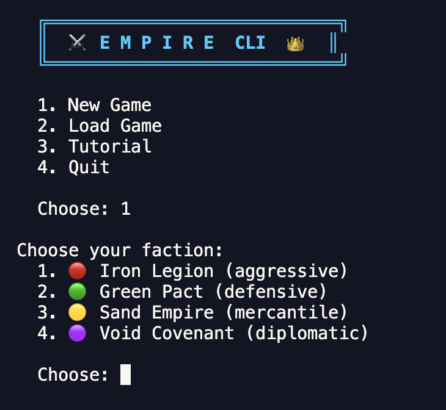

# ⚔️ Empire CLI 👑

[](https://www.npmjs.com/package/empire-cli)
[](https://opensource.org/licenses/MIT)

> **Status: Early MVP** — Core gameplay works. AI game master (Gemini/Ollama/Claude) coming soon.

A CLI turn-based strategy RPG where you build armies, expand your empire, and conquer the world. Open source, runs in any terminal.

## Screenshots




## Quick Start

```bash
# Play instantly (no install needed)
npx empire-cli

# Or clone for development
git clone https://github.com/lppduy/empire-cli.git
cd empire-cli
npm install
npm start
```

## Quick Tutorial

```
1. Start a new game → pick a faction (e.g. Iron Legion)
2. "map" — see the world map
3. "info northkeep" — inspect a territory
4. "recruit northkeep 3" — train 3 units (costs 3💰 + 2🍖 each)
5. "move northkeep greenwood 3" — march 3 units to Greenwood
6. "build northkeep walls" — build walls for defense (costs 🪵🪨)
7. "attack greenwood silver" — attack Silver Bay from Greenwood
8. "next" — end your turn (or use all 3 actions, auto-advances)
8. Watch enemy factions react — then plan your next move!
```

**Goal:** Conquer all 8 territories to win.

## Commands

You get **3 actions per turn**. `map`, `info`, `status`, `help`, `save` are free (don't cost actions).

| Command | Description |
|---------|-------------|
| `map` | Show world map |
| `info <territory>` | Show territory details & neighbors |
| `status` | Show your resources and army count |
| `move <from> <to> [n]` | Move n units between territories (all if omitted) |
| `recruit <territory> <n>` | Recruit n units at a territory |
| `attack <from> <to>` | Attack enemy territory from yours |
| `build <territory> <type>` | Build walls/barracks/market |
| `next` | End turn early |
| `save [slot]` | Save game |
| `help` | Show commands |
| `quit` | Exit |

## Factions

| Faction | Personality | Strengths |
|---------|-------------|-----------|
| 🔴 Iron Legion | Aggressive | High stone, strong start |
| 🟢 Green Pact | Defensive | High food & wood |
| 🟡 Sand Empire | Mercantile | High gold reserves |
| 🟣 Void Covenant | Diplomatic | Mountain fortress |

## Resources

- 💰 **Gold** — Recruit armies (3 per unit)
- 🍖 **Food** — Recruit + army upkeep (2 per unit)
- 🪵 **Wood** — Build structures
- 🪨 **Stone** — Build structures

## Buildings

| Building | Cost | Effect |
|----------|------|--------|
| 🧱 Walls | 10🪵 15🪨 | +0.3 defense bonus |
| 🏛️ Barracks | 8🪵 5🪨 | Recruit costs 2💰 instead of 3💰 |
| 🏪 Market | 10💰 5🪵 3🪨 | +2💰 income per turn |

## Roadmap

- [x] Core game loop with turn-based strategy
- [x] 4 factions with AI personalities
- [x] 8-territory map with adjacency
- [x] Combat system with terrain bonuses
- [x] Save/load game
- [x] Action limit per turn (3 actions)
- [ ] AI Game Master (Gemini free tier / Ollama / Claude) — dynamic narration
- [ ] Diplomacy system (alliances, trade, peace)
- [x] Buildings (walls, barracks, markets)
- [ ] More maps & factions
- [x] npm package (`npx empire-cli`) [](https://www.npmjs.com/package/empire-cli)

## Tech Stack

- TypeScript + Node.js 18+
- chalk (terminal colors)
- readline (input)
- JSON saves (`~/.empire-cli/saves/`)

## Development

```bash
npm start      # Play the game
npm run build  # Compile TypeScript
```

## License

MIT
